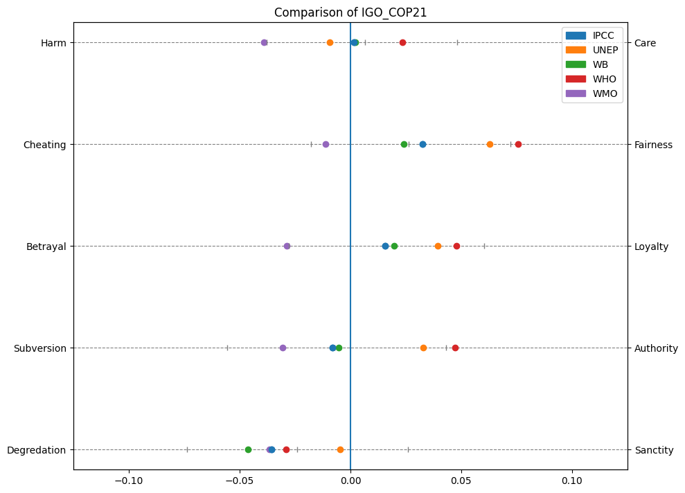

explain graphs + percentiles + what we have done so far

list of what we noticed + graphs

what we are going to do next

todo 
    group UN?
    rename Climate Institute to CI

### General:
+ dimensions are normally distributed
+ labels more like an exponential distribution
    + sometimes U-shaped
+ different labels might be interesting
    + technology
        + renewables, electric cars
        + CO2 capture, storage
        + electrical grid
    + consumption
        + capitalism
        + overconsumption
        + fast fashion
        + meat, agriculture
        + waste
    + politics
        + taxes, laws, regulations, restrictions
        + subventions, incentives
    + nature
        + animals, biodiversity
        + forests, trees
        + oceans, water
    + humans
        + kids, future generations
    + loss/gain of jobs
        + different sectors
    + health
    + energy
        + green energy, renewables
        + fossil fuels, coal, oil, gas
    + food
        + local, organic
        + vegan, vegetarian
    + pollution
        + air, water, soil
        + greenhouse gases, CO2, methane
    + poverty, climate justice
    + catastrophes
        + hurricanes, floods, droughts, fires
    + economy
        + growth, GDP
        + costs, investments
        + taxes, subventions

dimensions over time:
    - Presse outliers:  
        - 2015
        - a little bit: 2017, 2014
    - IGO outliers:
        - definitely 2009, 2011
        - 2015
    - NGO outliers:
        - 2017, 2019, 2016, 2021

### Presse:
+ different sources do not differ drastically
+ no notable differences between liberal, moderate, conservative
+ FT 
    + most care, loyalty
        + care towards money?
        + being careful instead of talking about threats
    + avg cheating
    + avg subversion?
    + more sanctity  
+ NYT
   + more harm - left newspaper making pressure by mentioning the potential harm
   + avg cheating
   + more betrayal
   + subversion changes a lot - avg i guess
   + more degradation
+ Telegraph
    + more harm
    + most cheating
    + betrayal avg
    + subversion changes a lot - more subversion?
    + more degradation
        + conservative and liberal pretty identical
+ Guardian
    + more care
    + most fairness
    + more loyalty
    + slightly more authority maybe?
    + avg sanctity
+ USAToday
    + most harm
    + more cheating
    + most betrayal
    + avg subversion
    + degredation changed a lot - no clue

### IGOs:
+ UN organizations are rather similar (dimension-wise)
    + UNFCCC, UNCDF, UNDP, REDD 
    + almost extreme
+ except for UNEP
    + UNEP seems rather average
    + more aligned with WB, IPCC
+ WB, WMO, IPCC mostly on the other end of the spectrum
+ holds for all dimensions (sanctity/degredation slightly less)
+ details
    + UNFCCC, UNCDF, UNDP, REDD
        + way more care, fairenss, loyalty, authority, sanctity
    + WB, IPCC
        + rather average except for sanctity/degredation
        + most sanctity/degredation
    + UNEP
        + behaves mostly like WB, IPCC
        + except for COP21, where it is more like UNFCCC, UNCDF, UNDP, REDD
            + which are not present for 2021
    + WMO
        + most care, fairness, loyalty, authority
        + average sanctity/degredation
    + WHO is pretty similar to UN (only 2021)

### NGOs:
+ harder to compare since there are many different organizations with relatively few documents
+ WWF pretty average
+ Oxfam pretty extreme
    + lots of care, fairness, loyalty, authority, sanctity
    + more average in COP21
+ EDF weird
    + average in COP21, extreme in COP15, other extreme in COP25_26
+ NRDC rather average
    + lots of degredation, else average
+ Greenpeace
    + lots of cheating
    + average harm, loyalty, authority
    + slightly more degredation
+ FoEI
    + pretty average
+ EJF
    + lots of fairness, betrayal

