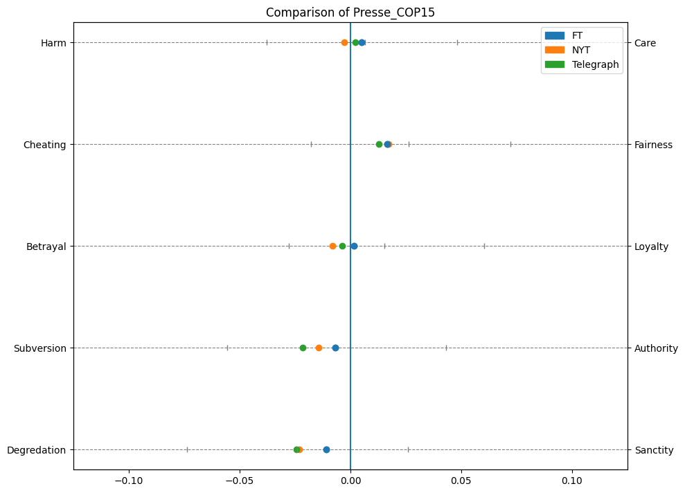
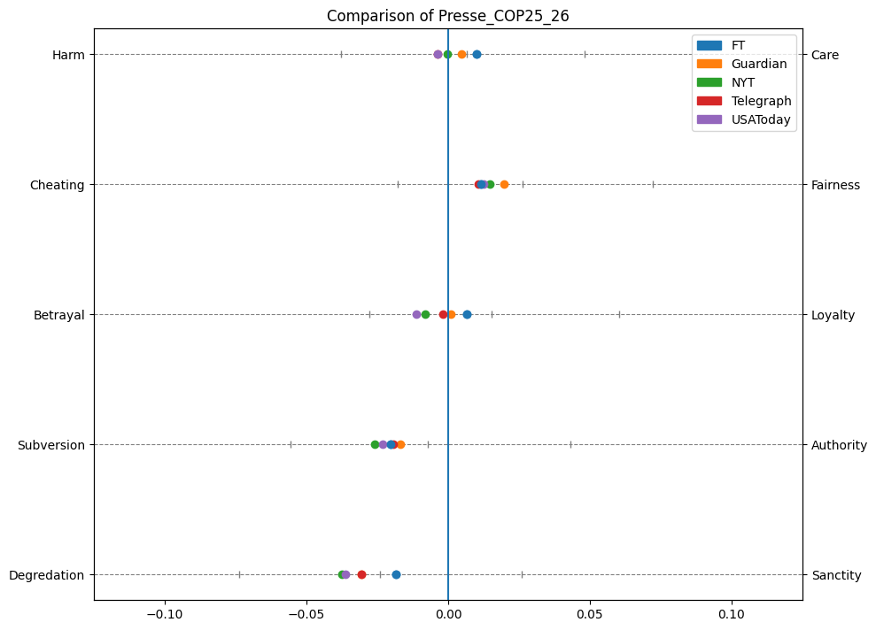
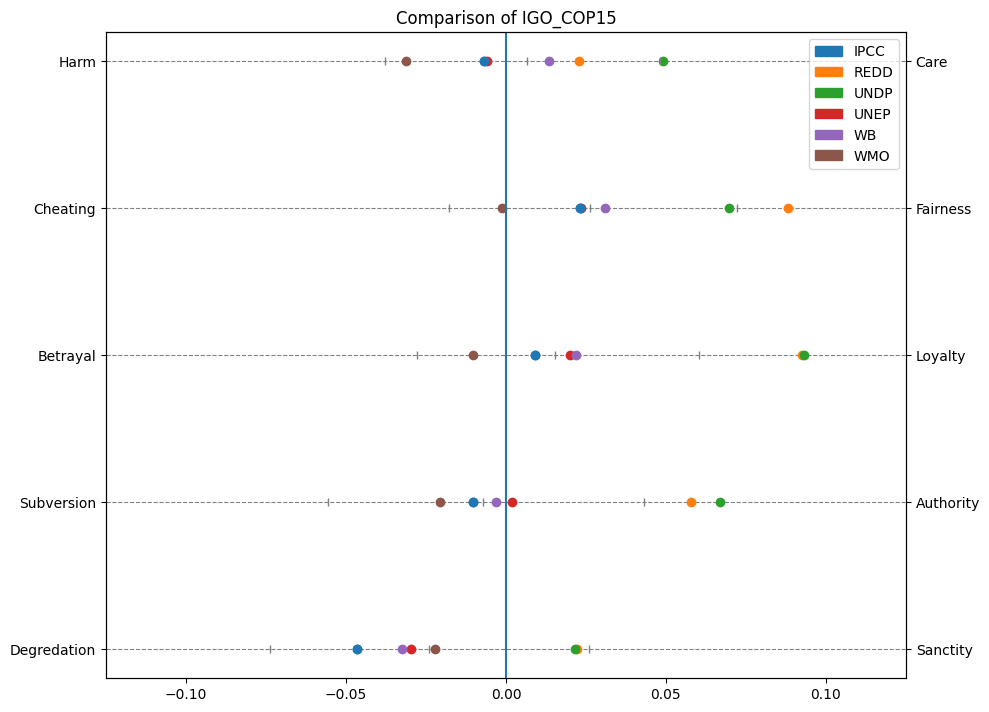

### Probability Distribution:
+ we looked at the probability distributions and histograms of the framing dimensions and labels to get a better feeling which values are noteworthy.
+ we are not quite sure how interesting this is
+ framing dimensions are normally distributed
    + all mean values are around 0
        + we are not quite sure why it is almost perfectly centered around 0
    + all values are between +/- 0.45
    + standard deviation is around 0.07
+ framing labels are more like an exponential distribution
    + different labels vary quite a lot
    + sometimes U-shaped
    + mean values are around 0.5
    + standard deviation is around 0.2

### Dimension Analysis
1. Press:
    + different sources do not differ drastically
    + we noticed no notable differences between liberal (NYT, Guardian), moderate (FT, USAToday) and conservative (Telegraph) newspapers
        + e.g. liberal newspapers do not necessarily have more care, while conservative newspapers have more harm - the differences are rather subtle
    + FT 
        + most care, loyalty
            + definitely does not deny climate change and does not artificially sugarcoat it
            + but does not emphasize the harm
        + more sanctity  
    + NYT
        + more harm
            + emphasizes the negative consequences of climate change more
            + often uses strong language (e.g. "catastrophic", "devastating", "kill", "threat")
            + at least this is my own judgement after comparing some FT, NYT articles, difference however is rather subtle imo
        + more betrayal
        + more degradation
    + Telegraph
        + more harm
            + often emphasize the negative consequences of proposed measures against climate change
            + e.g. quote "Sanctioning night scopes for culls will be endorsing something illegal across much of Europe."
            + seem to love quotes and anecdotes, often negative with strong language
            + though not all articles are completely negative 
        + most cheating
        + more degradation
            + conservative and liberal pretty identical
    + Guardian
        + more care
            + rather gentle language, not always though
                + e.g. "But it soon became apparent that things were not going to plan", "ministers started raising concerns.", "issues over 'loss and damage' emerged"
            + some climate "success stories"
            + optimistic language, e.g. "hope", "opportunity", "progress"
            + also likes quotes
        + most fairness
        + more loyalty
    + USAToday
        + most harm
            + most are pretty average but some articles almost read like a horror story
                + "Decades ago, London suffocated under poisonous smogs. Now, deadly air is back. ... Mayor Sadiq Khan now suggests children 
                should be given gas masks to protect their lungs. ... but it is poisonous … It is killing thousands of people" 
                + "Past a point of no return", "It was a slaughterhouse", "The result is a carpet of highly flammable fuel throughout the West's forests and grasslands"
        + more cheating
        + most betrayal
        + degredation changed a lot - no clue

2. IGOs:
+ UN organizations are rather similar (dimension-wise)
    + UNFCCC, UNCDF, UNDP, REDD 
    + almost extreme
+ except for UNEP
    + UNEP seems rather average
    + more aligned with WB, IPCC
+ WB, WMO, IPCC mostly on the other end of the spectrum
+ holds for all dimensions (sanctity/degredation slightly less)
+ details
    + UNFCCC, UNCDF, UNDP, REDD
        + way more care, fairenss, loyalty, authority, sanctity
    + WB, IPCC
        + rather average except for degredation where they have the most
    + UNEP
        + behaves mostly like WB, IPCC
        + except for COP21, where it is more like UNFCCC, UNCDF, UNDP, REDD
            + which are not present for 2021
    + WMO
        + most harm, cheating, betrayal, subversion
        + average sanctity/degredation
    + WHO is pretty similar to UN (only 2021)

3. NGOs:
    + harder to compare since there are many different organizations with relatively few documents
    + WWF pretty average
    + Oxfam pretty extreme
        + lots of care, fairness, loyalty, authority, sanctity
        + more average in COP21
    + EDF weird
        + average in COP21, extreme in COP15, other extreme in COP25_26
    + NRDC rather average
        + lots of degredation, else average
    + Greenpeace
        + lots of cheating
        + average harm, loyalty, authority
        + slightly more degredation
    + FoEI
        + pretty average
    + EJF
        + lots of fairness, betrayal

### Label analysis
1. Comparison Newspapers
    + The values of the various newspapers are generally around the same level
    + Economic and Capacity is by far the most pronounced. Which also makes sense in relation to climate change, as this has a major impact on the economy. 
    + It is interesting that Health and Safty is low - but Quality of life has a higher score which may means that the articles are more likely to state that climate change is affecting our health in general than public safety    
    + Although the Financial Times has a special business focus, it ranks 2nd only to the Telegraph 
      + Financial Times has the lowest values at all labels (except Economics)
   

2. Comparison IGO NGO Newspapers
   + Newspapers generally use more “buzz words” - this may explain why they have a much greater value in all labels 
   + NGOs (Non-Governmental Organizations) have much higher economic and capacity values than IGOs ( Intergovernmental Organizations). Which is the opposite of what you would expect - since you would think government organizations would prioritize economics more than NGOs
   + The biggest difference in Newspapers vs. scientific articles can be seen in Public / Political. As you would expect, papers are written much less politically and have fewer opinions of the general public than a newspaper.
   + On the other hand, IGOs are more pronounced in Quality and Health.
   + With security, however, it is as you would expect - IGOs have a greater value than NGOs

3. Comparison Left Right
    + FT center, USA Today center left, NYT center left, Guardian center left, Telegraph right
      +https://mediabiasfactcheck.com/
   + With the economic label, the order is as expected - the highest values from the right, then center before center-left
   + In the case of security, which refers among other things to “threats to the nation”, the order is also plausible. Right-wing media have the lowest value, followed by center. Center left sees climate change as the greatest threat.
     + At Quality - of life, the order is a little different. Center has the lowest value followed by right and center-left. The reason that the order is not the same as for Security could be that right-wing media report more on the fact that people feel restricted in their personal lives by climate protection measures and are therefore above center media. Center left media could write about how climate change impacts the Quality of life.

4. Comparison Press over Time
   + There is no recognizable pattern that has changed over the years. 
   + There has also been no particular change since the Paris Agreement was agreed (2015)

   + 2009 and 2017 are quite outliers for some labels in Political, Public, Quality, Security.
     + Assumption: 2009 - Leaked emails from the Climatic Research Unit were used by skeptics to claim data manipulation
     + 2017 - Trump announced the U.S. would withdraw from the Paris Agreement.
     + These 2 events may have led to a more intense discussion of climate change in the journals.

5. Comparison IGOs
   + The individual organizations spread much more than the different newspapers
   + UN
     + UNDP: United Nations Development Programme
     + UNEP: United Nations Environment Programme
     + UNCDF: United Nations Capital Development Fund
     + UNFCCC: United Nations Framework Convention on Climate Change.
   + World Bank (WB) stands out the most. Is more specialized in economics - It is in first place for Economic and Capacity but shows no trend as it is also in first place for all other labels.
   + WHO is more focused on people's health. You can see that at least a little with Health Label - where only WB is in front of it.
   + IPCC as the most important climate report does not stand out but is rather average everywhere.
